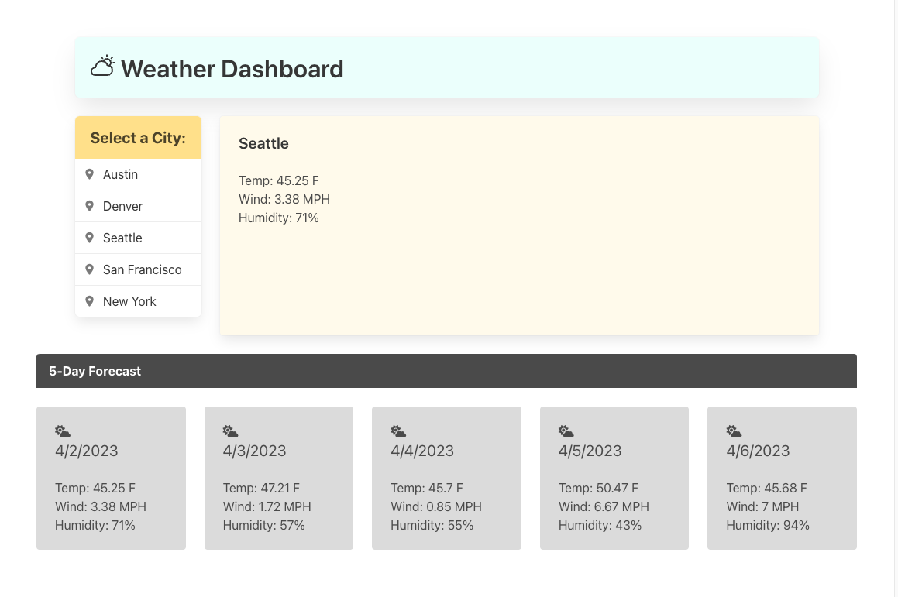

# Weather App
AS A traveler
I WANT to see the weather outlook for multiple cities
SO THAT I can plan a trip accordingly

## Use
The Five-Day Forecast app presents the user with a list of cities to choose from in order to look up the weather there. When the user selects a city, the current and future conditions for that city are displayed, including the date, temperature, humidity, wind speed for that city. These items are also stored to persist refreshes.

## Mock-Up
The following image shows the web application's appearance and functionality:

